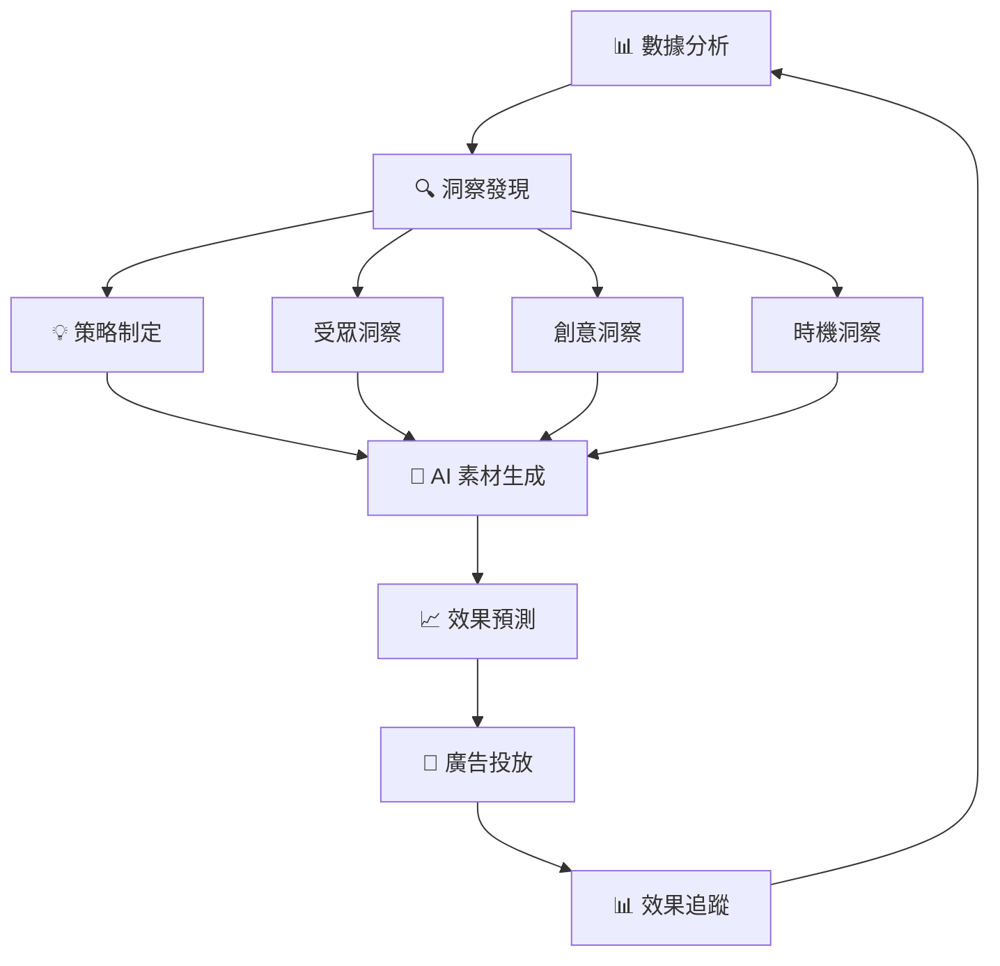

# 耘初茶食 Meta 廣告 Streamlit 儀表板分頁規劃

> **專案**: 耘初茶食 Meta 廣告數據分析儀表板
> **框架**: Streamlit
> **更新日期**: 2025-09-28

## 📋 整體架構設計

### 導航結構
使用 Streamlit 的 `st.sidebar` 建立左側導航選單，包含以下主要分頁：

```
🏠 首頁概覽
├── 📊 整體效能儀表板
├── 🎯 活動分析
├── 👥 受眾洞察
├── 💰 ROI 分析
├── 📈 趨勢分析
├── ⚡ 即時優化建議
├── 🤖 AI 素材製作
│   ├── ✍️ AI 文案生成
│   ├── 🎨 AI 圖片生成
│   └── 🧠 智能素材優化
└── 📋 詳細數據表格
```

---

## 📄 各分頁詳細規劃

### 🏠 第一頁：首頁概覽 (Homepage Overview)

#### 頁面目標
提供高階主管和決策者快速瞭解整體廣告表現的核心 KPI。

#### 核心內容
```markdown
1. **關鍵指標卡片區 (4x2 佈局)**
   - 總花費 (TWD)          | 總購買次數
   - 平均 ROAS             | 總觸及人數
   - 整體轉換率            | 平均 CPA
   - 總曝光次數            | 平均 CTR

2. **快速趨勢圖表**
   - 近 7 天 ROAS 趨勢線圖
   - 日花費 vs 日購買次數對比圖

3. **警報與狀態指示器**
   - 🟢 表現良好的活動數量
   - 🟡 需要關注的活動數量
   - 🔴 表現不佳的活動數量

4. **快速動作按鈕**
   - "查看詳細分析"
   - "下載今日報告"
   - "設定警報閾值"
```

#### Streamlit 組件
- `st.metric()` 用於 KPI 卡片
- `st.line_chart()` 用於趨勢圖
- `st.columns()` 用於佈局
- `st.info()` / `st.warning()` / `st.error()` 用於狀態提醒

---

### 📊 第二頁：整體效能儀表板 (Performance Dashboard)

#### 頁面目標
深入分析整體廣告投放效能，提供多維度的效能檢視。

#### 核心內容
```markdown
1. **時間範圍選擇器**
   - 日期範圍選擇器 (預設最近 30 天)
   - 快速選項：最近 7 天、30 天、90 天、全部

2. **效能指標矩陣**
   - ROAS 分佈直方圖
   - CPA vs 購買次數散點圖
   - CTR vs CPM 關係圖
   - 花費 vs 轉換效率氣泡圖

3. **漏斗轉換分析**
   - 觸及 → 曝光 → 點擊 → 瀏覽 → 加購 → 結帳 → 購買
   - 各階段轉換率和流失率
   - 漏斗視覺化圖表

4. **效能對比表格**
   - 各指標的目標值、實際值、達成率
   - 同期比較 (WoW, MoM)
   - 效能等級評分 (A/B/C/D)
```

#### Streamlit 組件
- `st.date_input()` 用於日期選擇
- `st.plotly_chart()` 用於互動圖表
- `st.dataframe()` 用於效能表格
- `st.progress()` 用於達成率顯示

---

### 🎯 第三頁：活動分析 (Campaign Analysis)

#### 頁面目標
針對個別行銷活動進行深度分析，協助優化活動策略。

#### 核心內容
```markdown
1. **活動選擇與篩選**
   - 活動下拉選單 (支援多選)
   - 投遞狀態篩選 (進行中/已暫停/已完成)
   - 目標類型篩選 (購買/加購物車/其他)

2. **活動效能排行榜**
   - Top 10 ROAS 最佳活動
   - Top 10 花費最高活動
   - Top 10 轉換次數最多活動
   - Bottom 5 需要優化的活動

3. **單一活動詳細分析**
   - 活動基本資訊 (名稱、期間、目標、狀態)
   - 核心 KPI 儀表板
   - 廣告組合表現對比
   - 日期效能趨勢圖

4. **活動對比功能**
   - 選擇 2-4 個活動進行對比
   - 並排 KPI 比較
   - 效能差異分析
   - 最佳實務建議
```

#### Streamlit 組件
- `st.multiselect()` 用於活動選擇
- `st.selectbox()` 用於篩選條件
- `st.bar_chart()` 用於排行榜
- `st.expander()` 用於詳細資訊展開

---

### 👥 第四頁：受眾洞察 (Audience Insights)

#### 頁面目標
分析不同受眾群體的表現，優化受眾定位策略。

#### 核心內容
```markdown
1. **受眾維度分析**
   - 年齡層效能分析 (圓餅圖 + 表格)
   - 性別效能比較 (條狀圖)
   - 年齡 x 性別交叉分析 (熱力圖)

2. **受眾表現矩陣**
   - ROAS vs 花費象限圖
   - 高價值受眾識別 (ROAS > 3.0 且花費 > 1000)
   - 機會受眾發現 (高 CTR 但低轉換)
   - 問題受眾警示 (低 ROAS 且高花費)

3. **受眾建議系統**
   - 建議擴展的受眾群組
   - 建議暫停的受眾群組
   - 建議測試的新受眾組合
   - 預算重分配建議

4. **受眾趨勢分析**
   - 月份受眾表現變化
   - 受眾疲勞度監控 (頻率分析)
   - 受眾生命週期分析
```

#### Streamlit 組件
- `st.pie_chart()` 用於年齡分佈
- `st.plotly_chart()` 用於象限圖和熱力圖
- `st.warning()` 用於受眾建議
- `st.metric()` 用於受眾 KPI

---

### 💰 第五頁：ROI 分析 (ROI Analysis)

#### 頁面目標
深度分析投資報酬率，提供預算優化建議。

#### 核心內容
```markdown
1. **ROI 概覽儀表板**
   - 整體 ROAS 趨勢圖
   - ROAS 分佈區間統計
   - 盈虧平衡點分析
   - ROI 達標率統計

2. **活動 ROI 排名**
   - ROAS 排行榜 (可視化排名)
   - 花費效益分析 (每元花費帶來的收益)
   - ROI 穩定性分析 (變異係數)
   - 投入產出效率評分

3. **預算優化建議**
   - 預算重分配模擬器
   - 最佳預算配置建議
   - 預期 ROI 提升計算
   - 風險評估分析

4. **成本分析**
   - CPA 趨勢分析
   - 成本結構分解
   - 成本效益對比
   - 成本控制建議
```

#### Streamlit 組件
- `st.slider()` 用於預算配置模擬
- `st.area_chart()` 用於 ROAS 趨勢
- `st.number_input()` 用於參數調整
- `st.success()` 用於優化建議顯示

---

### 📈 第六頁：趨勢分析 (Trend Analysis)

#### 頁面目標
分析時間序列趨勢，預測未來表現和發現週期性模式。

#### 核心內容
```markdown
1. **時間序列分析**
   - 日/週/月效能趨勢圖
   - 季節性模式識別
   - 週期性波動分析
   - 異常值檢測

2. **預測模型**
   - 未來 7/14/30 天 ROAS 預測
   - 花費預測與預算規劃
   - 轉換次數預期
   - 信賴區間顯示

3. **模式識別**
   - 最佳投放時段分析
   - 週末 vs 工作日效果比較
   - 月初/月中/月末效能對比
   - 特殊事件影響分析

4. **競爭分析指標**
   - CPM 趨勢 (市場競爭度指標)
   - CTR 變化 (創意疲勞度)
   - 頻率變化 (受眾飽和度)
```

#### Streamlit 組件
- `st.line_chart()` 用於趨勢圖
- `st.radio()` 用於時間粒度選擇
- `st.plotly_chart()` 用於預測圖表
- `st.info()` 用於趨勢解讀

---

### ⚡ 第七頁：即時優化建議 (Real-time Optimization)

#### 頁面目標
提供即時的、可執行的優化建議，協助快速決策。

#### 核心內容
```markdown
1. **智能警報系統**
   - 🚨 緊急警報：ROAS < 1.0 的活動
   - ⚠️ 注意警報：CPA > 目標值 50% 的活動
   - 💡 機會警報：高 CTR 但低轉換的廣告組

2. **自動化建議清單**
   - 建議暫停的活動 (含理由和預期影響)
   - 建議增加預算的活動 (含建議金額)
   - 建議優化的廣告組 (含具體操作)
   - 建議測試的新設定

3. **A/B 測試建議**
   - 創意測試建議
   - 受眾測試建議
   - 出價策略測試建議
   - 版位測試建議

4. **執行檢查清單**
   - 今日必做優化事項
   - 本週優化計劃
   - 下週測試準備
   - 效果追蹤提醒
```

#### Streamlit 組件
- `st.error()` / `st.warning()` / `st.info()` 用於警報
- `st.checkbox()` 用於執行清單
- `st.button()` 用於快速動作
- `st.expander()` 用於詳細建議展開

---

### 🤖 第八頁：AI 素材製作 (AI Creative Studio)

#### 頁面目標
基於數據分析結果，使用 AI 技術生成高效的廣告文案和圖片素材。

#### 核心內容
```markdown
1. **智能素材建議面板**
   - 基於高效活動的素材元素分析
   - 成功文案關鍵詞提取
   - 高轉換圖片特徵識別
   - 目標受眾偏好洞察

2. **數據驅動的素材策略**
   - 根據受眾分析推薦文案風格
   - 基於季節趨勢建議視覺元素
   - 競品分析啟發的創意方向
   - A/B 測試歷史成功模式

3. **快速創意工作流**
   - 一鍵生成多版本文案
   - 批量圖片風格變化
   - 創意組合自動配對
   - 素材效果預測評分
```

#### 子頁面結構
- **✍️ AI 文案生成** (第8.1頁)
- **🎨 AI 圖片生成** (第8.2頁)
- **🧠 智能素材優化** (第8.3頁)

---

### ✍️ 第8.1頁：AI 文案生成 (AI Copywriting)

#### 頁面目標
基於數據洞察生成高轉換率的廣告文案。

#### 核心內容
```markdown
1. **文案生成參數設定**
   - 目標受眾選擇 (年齡、性別、興趣)
   - 產品類別 (茶類、食品、禮盒等)
   - 文案風格 (專業、親切、促銷、情感)
   - 字數限制 (標題25字、內文90字等)

2. **數據驅動的文案建議**
   - 高 ROAS 活動的成功文案分析
   - 關鍵詞效果排行榜
   - 情感語調效果分析
   - CTA 按鈕用詞建議

3. **AI 文案生成器**
   - 多版本同時生成 (5-10個變化)
   - 風格變化選項 (正式/輕鬆/促銷)
   - 長短版本自動調整
   - 即時編輯與微調功能

4. **文案效果預測**
   - 基於歷史數據的 CTR 預測
   - 文案吸引力評分 (1-10分)
   - 目標受眾匹配度分析
   - 競品差異化程度評估
```

#### 生成流程
```python
# 範例生成流程
1. 選擇目標受眾 → 系統分析該受眾高效文案特徵
2. 設定產品資訊 → AI 理解產品賣點和定位
3. 選擇文案目標 → 品牌認知/導流/轉換/再行銷
4. 一鍵生成文案 → 5-10個版本供選擇
5. 效果預測評分 → 建議最優版本
6. 匯出到廣告平台 → 直接應用或進一步編輯
```

---

### 🎨 第8.2頁：AI 圖片生成 (AI Image Generation)

#### 頁面目標
基於品牌需求和數據洞察生成吸睛的廣告圖片。

#### 核心內容
```markdown
1. **圖片生成參數設定**
   - 產品類型 (茶葉、茶具、包裝、場景)
   - 視覺風格 (簡約、溫馨、專業、時尚)
   - 色彩偏好 (暖色調、冷色調、品牌色)
   - 圖片尺寸 (1080x1080、1200x628等)

2. **數據驅動的視覺建議**
   - 高 CTR 圖片的視覺元素分析
   - 成功色彩組合統計
   - 構圖模式效果比較
   - 受眾偏好的視覺風格

3. **AI 圖片生成器**
   - 多風格同時生成
   - 產品融入場景自動化
   - 品牌元素一致性保持
   - 背景自動替換功能

4. **圖片優化工具**
   - 自動品質提升
   - 廣告文字自動添加
   - 品牌 Logo 智能放置
   - 社群平台尺寸自適應
```

#### 生成工作流
```markdown
資料輸入 → AI 分析 → 圖片生成 → 效果預測 → 優化建議 → 批量匯出

具體步驟：
1. 上傳產品照片 (可選)
2. 選擇視覺風格和色調
3. 輸入關鍵描述詞
4. AI 生成多版本設計
5. 預測各版本 CTR 表現
6. 選擇最優版本進行微調
7. 匯出各平台適用尺寸
```

---

### 🧠 第8.3頁：智能素材優化 (Smart Creative Optimization)

#### 頁面目標
整合文案和圖片，基於數據分析提供完整的素材組合優化方案。

#### 核心內容
```markdown
1. **素材組合配對系統**
   - 文案與圖片的最佳配對建議
   - 視覺與文字風格一致性檢查
   - 受眾群體適配度分析
   - 競品差異化程度評估

2. **A/B 測試規劃器**
   - 自動生成測試變化組合
   - 測試參數建議 (預算、時間、受眾)
   - 統計顯著性預計算
   - 測試結果追蹤設定

3. **效能預測模型**
   - 基於歷史數據的 CTR 預測
   - ROAS 預期計算
   - 成本效益分析
   - 風險評估指標

4. **創意資料庫管理**
   - 所有生成素材的集中管理
   - 效能標籤和分類系統
   - 成功素材模板建立
   - 版本控制和歷史追蹤
```

#### 優化建議引擎
```python
# 智能建議範例
def generate_creative_recommendations(audience_data, performance_history):
    recommendations = {
        "文案建議": {
            "風格": "基於25-34歲女性群體，建議使用溫馨親切語調",
            "關鍵詞": ["手工", "天然", "溫暖", "品味"],
            "CTA": "立即體驗" (轉換率比"了解更多"高23%)
        },
        "視覺建議": {
            "色調": "暖色調表現較佳，建議米色+綠色組合",
            "構圖": "產品特寫+生活場景組合效果最佳",
            "元素": "添加手作感元素可提升親和力"
        },
        "投放建議": {
            "最佳時段": "週二-週四 19:00-21:00",
            "預算分配": "建議初期預算 $2000，測試3天後調整",
            "受眾設定": "擴展至相似受眾，預期 ROAS 提升15%"
        }
    }
    return recommendations
```

---

### 📋 第九頁：詳細數據表格 (Data Tables)

#### 頁面目標
提供完整的原始數據檢視和高階篩選功能，滿足深度分析需求。

#### 核心內容
```markdown
1. **進階篩選器**
   - 多欄位條件篩選
   - 數值範圍篩選 (ROAS, CPA, 花費等)
   - 日期範圍篩選
   - 文字搜尋功能

2. **可互動資料表**
   - 所有 46 個欄位的完整數據
   - 欄位排序功能
   - 條件格式化 (顏色標示好/壞表現)
   - 分頁顯示 (每頁 50/100/200 筆)

3. **數據匯出功能**
   - 篩選後數據匯出 CSV
   - 自定義欄位匯出
   - 匯出格式選擇 (Excel/CSV)
   - 匯出數據驗證

4. **快速統計**
   - 選取數據的即時統計
   - 小計和總計顯示
   - 條件計數功能
   - 數據品質檢查
```

#### Streamlit 組件
- `st.dataframe()` 用於可互動表格
- `st.column_config()` 用於欄位配置
- `st.download_button()` 用於數據匯出
- `st.number_input()` 用於範圍篩選

---

## 🔄 數據驅動的廣告優化工作流程

### 完整閉環優化流程



### 第一階段：數據分析與洞察發現

#### 自動化洞察提取
```python
class InsightEngine:
    def extract_creative_insights(self, performance_data):
        """從效能數據中提取創意洞察"""
        insights = {
            'top_performing_keywords': self.analyze_successful_copy(),
            'effective_visual_elements': self.analyze_image_performance(),
            'optimal_audience_characteristics': self.analyze_audience_data(),
            'best_timing_patterns': self.analyze_temporal_trends()
        }
        return insights

    def generate_data_driven_prompts(self, insights):
        """基於洞察生成 AI 創意提示"""
        prompts = {
            'copywriting_prompt': f"創建廣告文案，融入這些高效關鍵詞：{insights['top_performing_keywords']}",
            'image_prompt': f"生成圖片，包含這些成功元素：{insights['effective_visual_elements']}",
            'audience_targeting': f"針對此受眾特徵優化：{insights['optimal_audience_characteristics']}"
        }
        return prompts
```

### 第二階段：AI 素材生成策略

#### 智能文案生成
```markdown
基於數據洞察的文案生成邏輯：

1. **成功模式識別**
   - 分析高 ROAS 活動的文案結構
   - 提取有效的情感觸發詞
   - 識別最佳 CTA 用語

2. **受眾適配優化**
   - 年齡層語言風格調整
   - 性別偏好用詞選擇
   - 興趣導向內容焦點

3. **競品差異化**
   - 避免同質化表達
   - 突出獨特賣點
   - 創造記憶點

範例生成邏輯：
```python
def generate_copy_variants(audience_profile, product_info, performance_insights):
    base_elements = {
        'hook': extract_high_ctr_hooks(performance_insights),
        'benefit': map_audience_to_benefits(audience_profile, product_info),
        'cta': select_optimal_cta(audience_profile, campaign_objective)
    }

    variants = []
    for style in ['emotional', 'rational', 'urgency', 'social_proof']:
        copy = craft_copy(base_elements, style)
        predicted_score = predict_performance(copy, audience_profile)
        variants.append({'copy': copy, 'score': predicted_score, 'style': style})

    return sorted(variants, key=lambda x: x['score'], reverse=True)
```

#### 智能圖片生成
```markdown
數據驅動的視覺設計：

1. **色彩策略分析**
   - 統計高 CTR 圖片的主色調
   - 分析受眾偏好色彩組合
   - 品牌色彩一致性平衡

2. **構圖效果評估**
   - 產品佔比最佳化
   - 背景簡潔度影響
   - 文字可讀性優化

3. **情感共鳴設計**
   - 目標情感狀態識別
   - 場景選擇策略
   - 人物表情和動作

生成參數優化：
```python
def optimize_image_parameters(audience_data, product_category, performance_history):
    optimal_params = {
        'color_palette': analyze_color_performance(performance_history),
        'composition_style': determine_best_composition(audience_data),
        'mood_setting': map_audience_to_mood(audience_data),
        'text_overlay_style': optimize_text_placement(performance_history)
    }

    # 基於品牌一致性調整
    optimal_params = apply_brand_constraints(optimal_params, brand_guidelines)

    return optimal_params
```

### 第三階段：智能測試與優化

#### A/B 測試自動化
```markdown
智能測試框架：

1. **測試設計自動化**
   - 基於統計顯著性計算樣本量
   - 自動生成測試變數組合
   - 預設測試週期和預算分配

2. **實時效果監控**
   - 早期停止機制 (顯著差異出現時)
   - 異常檢測和警報
   - 效果趨勢實時追蹤

3. **結果分析與應用**
   - 勝出素材自動推廣
   - 失敗原因自動分析
   - 學習成果回饋到生成模型
```

#### 持續優化引擎
```python
class ContinuousOptimization:
    def __init__(self):
        self.performance_tracker = PerformanceTracker()
        self.insight_engine = InsightEngine()
        self.creative_generator = CreativeGenerator()

    def run_optimization_cycle(self):
        """執行一個完整的優化週期"""
        # 1. 收集最新效能數據
        latest_data = self.performance_tracker.get_recent_performance()

        # 2. 識別優化機會
        opportunities = self.insight_engine.identify_opportunities(latest_data)

        # 3. 生成新的創意變化
        for opportunity in opportunities:
            new_creatives = self.creative_generator.generate_variants(opportunity)
            self.schedule_ab_test(new_creatives, opportunity)

        # 4. 更新模型參數
        self.update_prediction_models(latest_data)
```

---

## 🎨 UI/UX 設計原則

### 色彩配置
```css
主色調：#1f77b4 (藍色 - 專業感)
輔色調：#ff7f0e (橙色 - 警示/重點)
成功色：#2ca02c (綠色 - 正面指標)
警告色：#d62728 (紅色 - 負面指標)
中性色：#7f7f7f (灰色 - 背景資訊)
```

### 響應式設計
- 支援桌面端 (1920x1080) 和筆電端 (1366x768)
- 自適應圖表大小
- 折疊式側邊欄 (小螢幕時)

### 載入效能
- 使用 `@st.cache_data` 快取數據處理
- 延遲載入非關鍵圖表
- 進度條顯示載入狀態

---

## 🔧 技術實作架構

### 檔案結構
```
meta-ads-dashboard/
├── app.py                      # 主應用程式
├── pages/                      # 各分頁模組
│   ├── 01_overview.py         # 首頁概覽
│   ├── 02_performance.py      # 整體效能
│   ├── 03_campaigns.py        # 活動分析
│   ├── 04_audience.py         # 受眾洞察
│   ├── 05_roi.py              # ROI 分析
│   ├── 06_trends.py           # 趨勢分析
│   ├── 07_optimization.py     # 優化建議
│   ├── 08_ai_creative.py      # AI 素材製作 (主頁)
│   ├── 08_1_ai_copywriting.py # AI 文案生成
│   ├── 08_2_ai_image.py       # AI 圖片生成
│   ├── 08_3_smart_optimize.py # 智能素材優化
│   └── 09_data_tables.py      # 數據表格
├── ai_modules/                 # AI 功能模組
│   ├── __init__.py
│   ├── copywriter.py          # 文案生成引擎
│   ├── image_generator.py     # 圖片生成引擎
│   ├── performance_predictor.py # 效果預測模型
│   └── insight_extractor.py   # 洞察提取引擎
├── utils/                      # 工具函數
│   ├── __init__.py
│   ├── data_loader.py         # 數據載入
│   ├── analyzer.py            # 分析邏輯
│   ├── visualizations.py      # 圖表函數
│   └── api_clients.py         # API 客戶端
├── config/                     # 配置檔案
│   ├── settings.py            # 全域設定
│   ├── prompts.py             # AI 提示詞模板
│   └── brand_guidelines.py    # 品牌規範
├── assets/                     # 靜態資源
│   ├── images/                # 圖片資源
│   ├── templates/             # 創意模板
│   └── fonts/                 # 字體檔案
├── .env                       # 環境變數 (API 金鑰等)
├── requirements.txt           # 依賴套件
└── 耘初茶食.xlsx              # 數據檔案
```

### 核心函數設計
```python
# 數據載入與快取
@st.cache_data
def load_meta_ads_data():
    """載入並預處理 Meta 廣告數據"""
    pass

# 通用分析函數
def calculate_performance_metrics(df, group_by=None):
    """計算效能指標"""
    pass

# 圖表生成函數
def create_roas_trend_chart(df, time_period='daily'):
    """生成 ROAS 趨勢圖"""
    pass
```

---

## 📱 使用者體驗流程

### 典型使用場景

#### 場景 1：每日晨會檢視 (3分鐘)
1. 打開首頁概覽
2. 快速檢視核心 KPI
3. 查看警報狀態
4. 前往優化建議頁面確認待辦事項

#### 場景 2：週度效能檢討 (15分鐘)
1. 整體效能儀表板檢視趨勢
2. 活動分析比較表現
3. 受眾洞察發現機會
4. ROI 分析制定預算策略

#### 場景 3：月度策略規劃 (60分鐘)
1. 趨勢分析了解長期模式
2. 詳細數據表格深度挖掘
3. 活動分析總結成功案例
4. 優化建議規劃下月重點

---

## 🚀 開發順序建議

### Phase 1：基礎架構 (第1-2天)
1. 設定 Streamlit 基本架構
2. 建立導航系統
3. 實作數據載入邏輯
4. 完成首頁概覽

### Phase 2：數據分析功能 (第3-5天)
5. 整體效能儀表板
6. 活動分析頁面
7. 受眾洞察頁面
8. ROI 分析頁面

### Phase 3：進階分析功能 (第6-7天)
9. 趨勢分析頁面
10. 優化建議頁面
11. 詳細數據表格

### Phase 4：AI 素材製作功能 (第8-10天)
12. AI 素材製作主頁架構
13. AI 文案生成模組
    - 洞察提取引擎
    - 文案生成器
    - 效果預測模型
14. AI 圖片生成模組
    - 圖片生成 API 整合
    - 品牌一致性檢查
    - 多尺寸輸出功能
15. 智能素材優化
    - 組合配對系統
    - A/B 測試規劃器
    - 創意資料庫管理

### Phase 5：整合與優化 (第11-12天)
16. 數據驅動工作流程整合
17. 跨頁面功能聯動
18. UI/UX 調整優化
19. 效能優化和全面測試

### Phase 6：部署與文件 (第13天)
20. 生產環境部署準備
21. 使用者手冊撰寫
22. API 金鑰管理設定
23. 監控和日誌系統

---

## 📝 開發注意事項

1. **數據安全**：確保敏感數據不會被快取到公共空間
2. **效能優化**：大數據集的處理要使用適當的快取策略
3. **錯誤處理**：優雅處理檔案不存在或數據格式錯誤
4. **多語言支援**：介面中英文混合要保持一致性
5. **行動端適配**：雖然主要為桌面端設計，但需考慮基本的行動端瀏覽

---

**規劃文件完成，準備開始逐頁開發！** 🚀